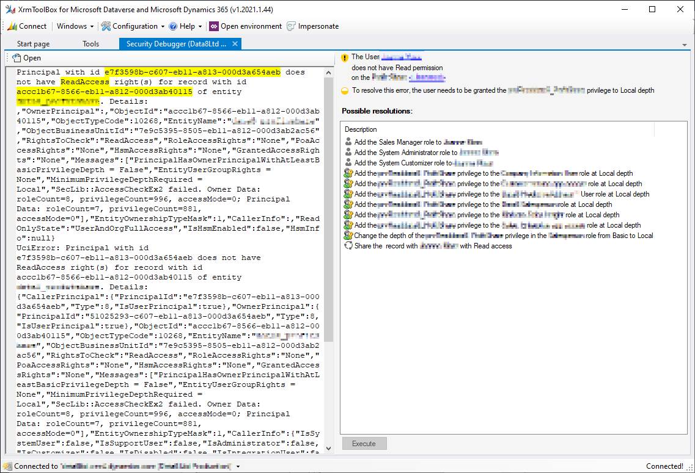

# Security Debugger tool for XrmToolBox

If you're confronted with an error message from a Dynamics CRM/365/Dataverse user that's something to do with
permissions but full of scary-looking codes, this tool can help you decode it and even give you some options
to fix it!

## Installing

Install the Security Debugger tool from the XrmToolBox tool store

## User Guide

When your user encounters a permissions error, ask them to click the Technical Details link or download the log file, whichever
is available.

Copy & paste the error message into the text box in this tool, or click the Open button and select the log file.

If the error message is one that the tool understands, the important bits of information will be highlighted and the right
hand side of the screen will be updated with links to the relevant records and some suggested fixes that could help.